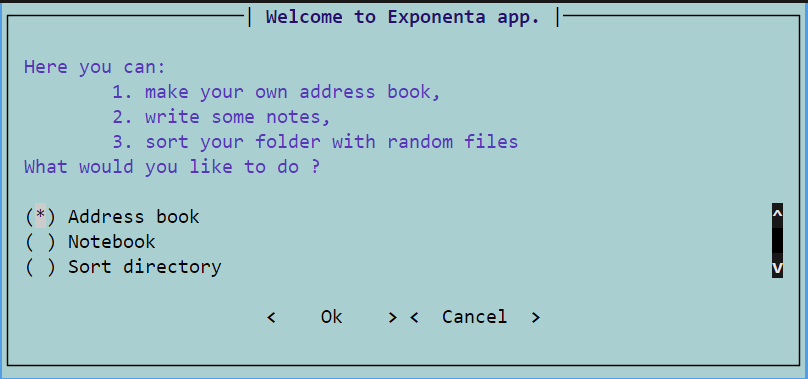

# Core-project-group3

# Exponenta app

[Include a brief description of your project here.]

## Table of Contents

- [Features](#features)
- [Installation](#installation)
- [Usage](#usage)
- [Authors](#authors)
- [License](#license)

## Features

Key features:
- Sorting of the specified directory with files by extensions and automatic extraction of archives.
- Maintaining a contact book with the storage of phone numbers, emails, addresses, and birthdays.
- Notepad with notes.

## Installation

1. Clone project to your device. 
2. Open the terminal in folder you downloaded the repo.
3. Write `cd exponenta-app`
4. Write `pip install -e .`
5. Wait finishing the installation.
6. Congratulations! Now you can use the 'exponenta-app' command to run the program from any place on your computer

## Usage

### Main menu

To choose the module you need with arrows and Enter/Return, then press Tab to choose 'Ok' and Enter/Return. 
To exit from the app press Tab twice to choose 'Cancel', then Enter/Return.

### Sorting 

Enter the full folder path you want to sort and press Enter/Return.

> Example: d:\folder_with_scrap

Wait 'till your folder is sorted. 
Return to the main menu will be done automatically.

### Address Book

If you have saved the address book in phone_book.bin it will load automatically.
Use 'help' command to see all possible commands and input formats.
In case you have less than 10 digits in your phone number write 0 on start 'till your phone will be 10 digits long.

Help message:

> add 'name' 'phone'  - add name and phone number (10 digits) to the dictionary

> add_birthday 'name' 'birthday' - add birthday date to the name in the dictionary

> add_phone 'name' 'phone' - add phone number (10 digit) to the name in dictionary

> add_adress 'name' 'adress' - add address to the name in dictionary

> change 'name' 'phone' 'new_phone' - change phone number (10 digit) for this name

> days_to_birthday 'name' - return number days to birhday

> birthday 'num' - return records with birthday date in 'num' days

> delete_record 'name' - delete record for this name from the dictionary

> delete_adr 'name' - remove address for this name

> delete_phone 'name' 'phone' - remove phone for this name

> find info - find all records including 'info' in Name or Phone

> search str: min 3 symbols - find all records including 'str' in Name or Phone or Adress

> hello - greeting

> email name [email@domain.com] - add OR change email for specified Name

> phone name - show phone number for this name

> adress name - show address for this name

> remove_phone name phone - remove phone for this name

> show_all  -  show all records in the dictionary

> show_all N - show records by N records on page

> exit or close or good_bye - exit from module

After exiting from the address book, your contacts will be saved to 'phone_book.bin'.

### Notebook

Load from 'notes.bin' if exists, create it if not.
Automatically parse tags from the text of the note and save them to the tag list.

Help message:

> add 'any string'       - add new record to notebook

> show                   - show all records

> sort                   - sort records by tags

> find 'text'            - find records by part

> change 'number' 'text' - changing a record by its number

> delete 'number'        - removing a record by its number

> help                   - notebook commands list

> exit                   - leave notebook

After exiting from the notebook, it will be saved to 'notes.bin'.

## Authors

+ [Mariia Turbanova](https://github.com/UreshiiSushi)
+ [Yurii Protsenko](https://github.com/JurijProcenko)
+ [Oleksandr Pripa](https://github.com/olpripa)
+ [Oles Bychevskyi](https://github.com/olesbychevsky)
+ [Alex Lomakin](https://github.com/lomakina0612)
+ [Oleksandr Kondratiuk](https://github.com/1Oleksandr)

## License

This project is licensed under the MIT License - see the [LICENSE.md](LICENSE.md) file for details.

